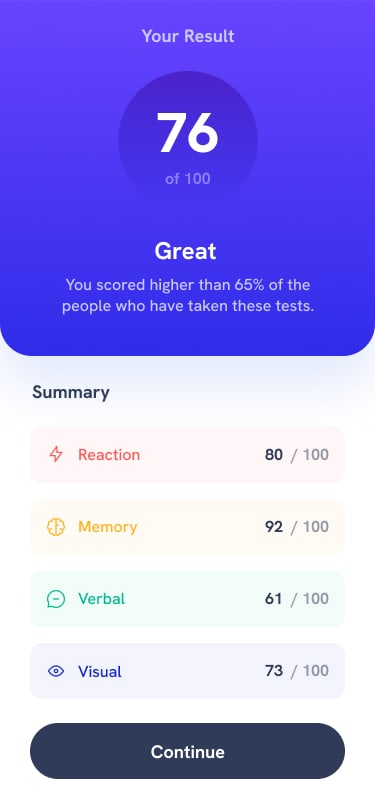

# Blog Preview Card Challenge

This result summary card is one of many challenges from Frontend Mentor.

## Challenge

* [Frontend Mentor Challenge URL](https://www.frontendmentor.io/challenges/blog-preview-card-ckPaj01IcS)
* Built with: [HTML/CSS, etc.]

## My Process

* Built with semantic HTML5 and CSS3
* Used Flexbox for layout (adjust based on what you used)
* Mobile-first workflow
* used media queries

## Views

| Device | Screenshot |
|--------|------------|
| Desktop | 

 

|
| Mobile | 

 

|

## Live Demo

[View live project](https://wonderful-ganache-aee088.netlify.app/) <!-- Add your deployed link here -->

## solution URL Link

* [Solution URL](https://github.com/Abdull-Code/result-summary-card) <!-- Add your solution URL here -->
